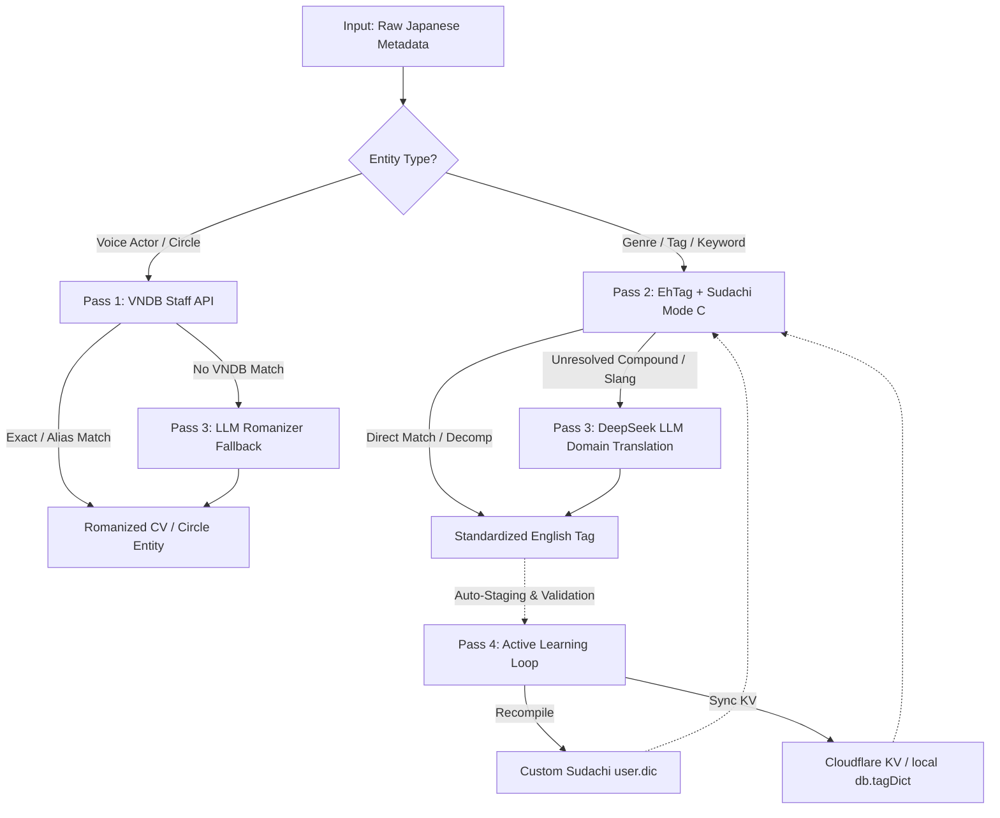

# ASMR Tag & Voice Actor 4-Pass Translation Pipeline Plan

## 1. Executive Summary

This document outlines the architecture, data structures, and implementation roadmap for the 4-Pass Hybrid Translation and Entity Resolution Pipeline designed for **streasmr**. The system provides fast, accurate, and culturally nuanced Romanization and English localization of Japanese ASMR metadata (voice actors, circles, genres, sound effects, and novel roleplay tropes).



---

## 2. The 4-Pass Architecture

### 🎙️ Pass 1: Voice Actor & Creator Resolution (Jikan MAL API & VNDB)
- **Target**: Voice Actors (CV), Sound Directors, Scenario Writers, Circle Names.
- **Problem**: Japanese voice actors frequently use pseudonyms (*urameigi* / 裏名義) for R18/doujin works that differ from their mainstream all-ages anime names (e.g., `民安ともえ` vs `たみやすともえ`, `秋野かえで`, etc.).
- **Strategy**:
  - **Primary MAL Lookup**: Query Jikan REST API v4 (`https://api.jikan.moe/v4/people?q=<NAME>&limit=1`) to resolve mainstream, crossover, and credited seiyuu directly into Hepburn Romanization (`Akino Kaede`, `Tamiyasu Tomoe`, `Hanazawa Kana`, etc.).
  - **Secondary VNDB Query**: Direct HTTP query to VNDB Kana API (`https://api.vndb.org/kana/staff`) for visual novel staff aliases.
  - **Caching**: Stored in `data/astreamer_db.json` and Cloudflare KV `tagDict` for instantaneous $O(1)$ lookup.
  - **Fallback**: Any unresolved niche indie doujin names automatically fall through to Pass 3 (DeepSeek LLM).

---

### 🏷️ Pass 2: Genre & Concept Localization (EhTag + Sudachi Mode C)
- **Target**: Descriptive genres, sound categories, fetish tags, situational tropes.
- **Strategy**:
  - **EhTag Raw Key Mapping**: Ingest raw JSON/YAML directly from the `EhTagTranslation/Database` repository. By taking the primary Japanese keys from namespace files (`female`, `male`, `fetish`, `mixed`, `concept`), we map Japanese directly to English without Chinese intermediary interference.
  - **Sudachi Tokenizer Engine**:
    - Mode C (Agglutinative compound detection): Matches complex compound phrases as single terms (e.g., `バイノーラル耳かき立体音響`).
    - Mode A/B (Fallback decomposition): Breaks unknown long strings into recognized atomic tokens when full match fails.
    - Custom user dictionary (`user.dic`): Built with domain-specific ASMR vocabulary.

---

### 🧠 Pass 3: DeepSeek LLM Domain Fallback
- **Target**: Creative roleplay titles, novel onomatopoeia (`じゅるじゅる`, `とろとろ`), niche slang, compound fetish phrases.
- **Strategy**:
  - Query DeepSeek Chat API using a strictly calibrated few-shot system prompt tailored for ASMR and doujin audio.
  - Strict JSON output schema: `{ "original": "...", "translated": "...", "confidence": 0.95, "type": "tag" | "cv" | "circle" }`.
  - Enforced anti-hallucination constraints (e.g., preserves established terminology conventions).

---

### 🔄 Pass 4: Active Learning & Self-Compiling Feedback Loop
- **Target**: Continuous self-improvement and eliminating recurring API costs/latency.
- **Strategy**:
  - LLM results from Pass 3 with confidence $\ge 0.90$ (or validated by human review) are appended to `data/staging_terms.csv`.
  - Build script compiles staging terms into:
    1. **Sudachi `user.dic`**: For offline, sub-millisecond local NLP tokenization.
    2. **Cloudflare KV `db.tagDict`**: For instant $O(1)$ frontend/worker tag rendering.
  - Subsequent requests for these terms resolve in Pass 2 without ever calling Pass 3 again.

---

## 3. Data Schema & Web UI Integration

### Tri-Part Dictionary Schema
```json
{
  "焦らし": {
    "romaji": "Jirashi",
    "english": "Teasing"
  },
  "民安ともえ": {
    "romaji": "Tamiyasu Tomoe",
    "isCV": true
  }
}
```

- **Voice Actor Formatting**: `Original | Romaji` (e.g. `民安ともえ | Tamiyasu Tomoe`).
- **Genre Tag Formatting**: `Original | Romaji | English` with single concise primary words (e.g. `焦らし | Jirashi | Teasing`, `乳首責め | Chikubi Zeme | Nipple Stimulation`).

### Dual Search Bars Architecture
1. **Search Bar 1 (Top)**: Title, Circle, and RJ code query (`#globalSearch`, `#mobileSearchInput`).
2. **Search Bar 2 (Directly below)**: Tag search (`#globalTagSearch`, `#mobileTagSearchInput`).
   - Supports multilingual matching (Japanese original, Romaji, English).
   - Supports `+` operator for multi-tag AND filtering (e.g. `ear cleaning + whisper + binaural`).
   - Live glassmorphism autocomplete suggestions dropdown with work counts (`#tagSuggestionsDropdown`).

---

## 4. Directory Layout

```text
streasmr/
├── plan.md                       # This master plan
├── vndb_resolver.js              # Pass 1: VNDB API Voice Actor resolver
├── ehtag_resolver.js             # Pass 2: EhTag taxonomy & compound tokenizer
├── llm_resolver.js               # Pass 3: DeepSeek OpenRouter LLM fallback
├── test_vndb_cv.js               # Pass 1 test suite
├── test_pass2_tags.js            # Pass 2 test suite
├── test_pass3_llm.js             # Pass 3 test suite (Node.js)
├── test_pass3_llm.py             # Pass 3 test suite (Python)
├── db.js                         # Local JSON database & tri-part BASE_TAG_DICT
├── server.js                     # Local dev server & Web UI
└── worker.js                     # Cloudflare Worker production runtime
```

---

## 4. Execution Phases & Milestones

### Phase 1: Pass 1 Implementation & Validation (Current Focus)
1. Build `src/resolver/vndb_client.js`:
   - Query VNDB `/kana/staff` API.
   - Handle rate limiting (200 requests/5 min burst).
   - Normalize names (Hepburn Romanization, western `Given Family` or traditional `Family Given`).
   - Implement persistent file-backed caching (`data/cv_cache.json`).
2. Run validation against existing database CVs (`data/astreamer_db.json` & extracted DLsite works).
3. Test edge cases:
   - Artists with multiple aliases (e.g. `秋野花`, `小鳥遊結衣`, `民安ともえ`).
   - Circles/groups vs individual voice actors.
   - Unlisted/indie voice actors.

### Phase 2: Pass 2 Ingestion & Tokenizer Pipeline
1. Ingest raw EhTagTranslation dataset and extract JP $\to$ EN direct mapping.
2. Setup Sudachi user dictionary CSV definition.
3. Test compound term decomposition and tag normalization.

### Phase 3: Pass 3 DeepSeek LLM Fallback Integration
1. Build prompt template with few-shot ASMR domain context.
2. Connect fallback resolver for misses from Passes 1 and 2.

### Phase 4: Pass 4 Active Learning Loop & Sync
1. Staging dictionary accumulator.
2. Automate rebuild and Cloudflare KV sync.
